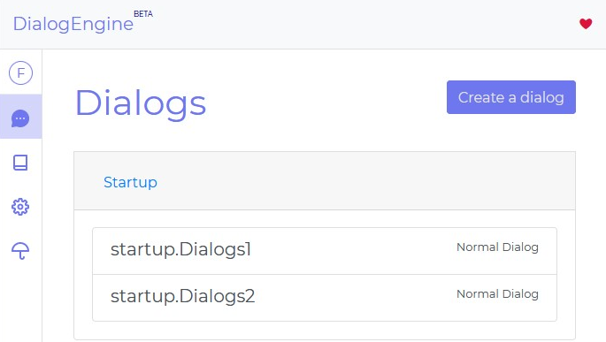
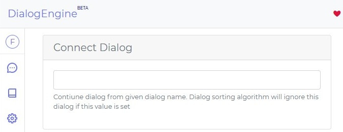
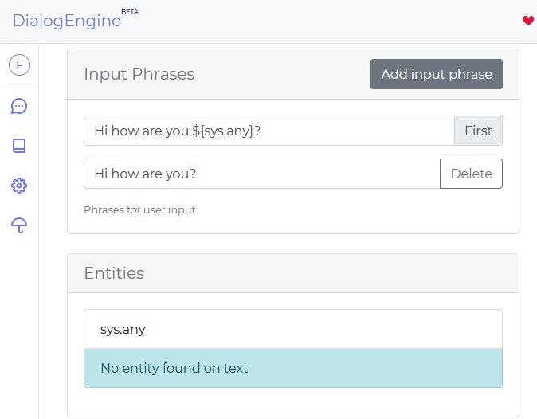

# Diyalog oluşturmak

Arayüzün sol tarafındaki menüde bulunan `Diyaloglar` sekmesine girin

Sol üst taraftaki `Diyalog Oluştur` butonuna tıklayın

## Diyalog İsmi

`Diyalog ismi` her bir diyaloğunuza vereceğiniz isimdir. Her diyalog farklı bir isim almalıdır. `Diyalog ismi` sözdizimi boşluk yerine noktalar kullanır ve her noktadan sonra büyük harf ile başlanır. Örn: `test.Dialog1` içinde en az bir nokta kullanan diyaloglar ilk noktadan önce olan kelime ile sınıflandırılır Örneğin eğer `startup.Dialogs1` ve `startup.Dialogs2` olarak iki diyalog kaydederseniz. [Diyaloglar](./dialogs) sayfasında resimdeki gibi görünür.

Fakat eğer ki diyalog isminizi `diyalog1` gibi nokta içermeyen şeklinde oluşturursanız resimdeki gibi görünür

# Diyalogları Bağlama

Bir sohbette ard arda soracağımız diyalogları birleşitirmek için `Başka diyaloğa bağla` bölümünü kullanırız. Bu kısma ondan sonra devam etmesini istediğimiz [Diyalog ismini](#diyalog-İsmi) gireriz.

> connected.Dialog1 > connected.Dialog2 > connected.Dialog3

gibi. Önemli not: başka diyaloğa bağlı olan diyaloglar algoritma tarafından es geçilirler, sadece bir önceki soru eğer bağlı olan diyaloğun ismine eşitse seçilirler

## Tanımlama Cümleleri

Tanımlama cümleleri kullanıcınızın sorusuyla kıyaslanacak cümleler grubudur.

### Örnekler

Tanımlama Cümlesi
> Merhaba ${sys.any}!

Soru
> Merhaba Friday!

Entityler: 

> 'sys.any': 'Friday'

## Entity diyaloglarında yanlışlar

### Yanlış kullanım

 - ${sys.any}${sys.any} nasıldır?
 - İstanbulTürkiye nasıldır?

`sys.any` ard arda kullanılamaz.

### Doğru kullanım

 - ${sys.any}, ${sys.any} nasıldır?
 - İstanbul Türkiye nasıldır?

## Diyalog Yanıtları

`Diyalog yanıtları` kullanıcı sorusu işlendiğinde tüm yanıtlardan rastgele gelir. Her bir `Diyalog yanıtının` kendi [cevapları](./responses.md) vardır

## Diyalog önizleme

Seçili olan diyalog grubunuzu `Diyalog önzileme` sayesinde sohbette nasıl gözükeceğini görebilirsiniz

