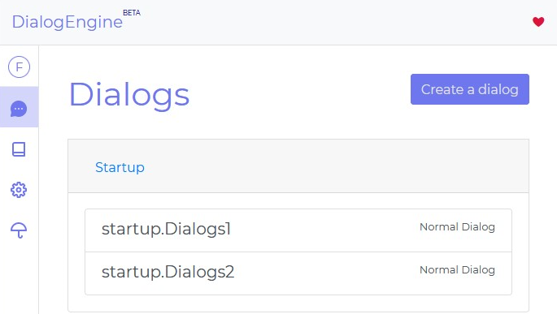

# Dialogs

You can update or delete them by clicking on the dialogs on the dialogs page.

## Fallbacks

Dialogues where you can get a direct response without doing sentence analysis are called `fallbacks`. There are three `fallbacks` that the system recognizes: 'welcome.Fallback', 'unknown.Fallback' and 'maintenance.Fallback'. You can save the `fallbacks` that you can use for your own purpose as `{name.Fallback}`.

---

## `welcome.Fallback`

This is used by Services. Each service can use this response differently. For example, DialogEngine Messenger uses this response when the user opens the page or window.

## `unknown.Fallback`

It is the answer that will be used instead of `unknown dialog` in unmatched dialogs.

## `maintenance.Fallback`

It is the response that will send to the user in maintenance mode
