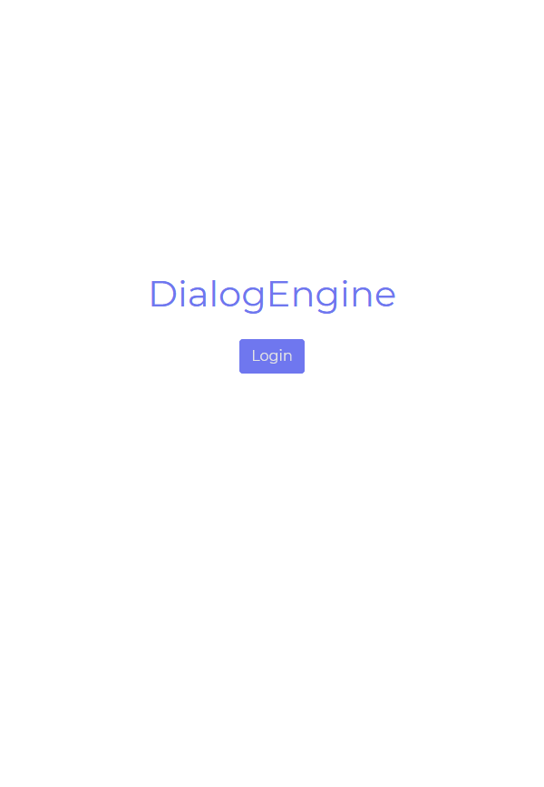

# Welcome to DialogEngine Docs

### Table of contents
- [Getting Started](#getting-started)
  - [Creating Assistant](./creatingAssistant)   
  - [Creating Dialog](./creatingDialogs)
  - [DialogEngine SDKs](./sdk)
  - [DialogEngine Worker](./worker)
- [Assistant Tab](./assistant)
- [Dialogs Tab](./dialogs)
- Examples **Not Completed**
- [Katkı](#katkı)
- [Versiyonlama](#versiyonlama)
- [Lisans](#lisans)

# Getting Stared
Welcome to Behemehal services! Before you start you have to create a [behemehal account](https://behemehal.net/login). After you create the account you can head foward to [DialogEngine Panel](https://dialogengine.behemehal.net/panel.html).



Next step [Creating Assistant](./creatingAssistant)


# Contribution
We care about your opinions and ideas. If the repo you want to contribute has rules for contribution you can help us by following these rules.


# Versioning
This project uses [Semantic Versioning](https://semver.org/). Incoming feature and security updates provide backward compatibility with the same generation

# [License](../LICENSE)

```
MIT License

Copyright (c) 2020 Behemehal

Permission is hereby granted, free of charge, to any person obtaining a copy
of this software and associated documentation files (the "Software"), to deal
in the Software without restriction, including without limitation the rights
to use, copy, modify, merge, publish, distribute, sublicense, and/or sell
copies of the Software, and to permit persons to whom the Software is
furnished to do so, subject to the following conditions:

The above copyright notice and this permission notice shall be included in all
copies or substantial portions of the Software.

THE SOFTWARE IS PROVIDED "AS IS", WITHOUT WARRANTY OF ANY KIND, EXPRESS OR
IMPLIED, INCLUDING BUT NOT LIMITED TO THE WARRANTIES OF MERCHANTABILITY,
FITNESS FOR A PARTICULAR PURPOSE AND NONINFRINGEMENT. IN NO EVENT SHALL THE
AUTHORS OR COPYRIGHT HOLDERS BE LIABLE FOR ANY CLAIM, DAMAGES OR OTHER
LIABILITY, WHETHER IN AN ACTION OF CONTRACT, TORT OR OTHERWISE, ARISING FROM,
OUT OF OR IN CONNECTION WITH THE SOFTWARE OR THE USE OR OTHER DEALINGS IN THE
SOFTWARE.
```