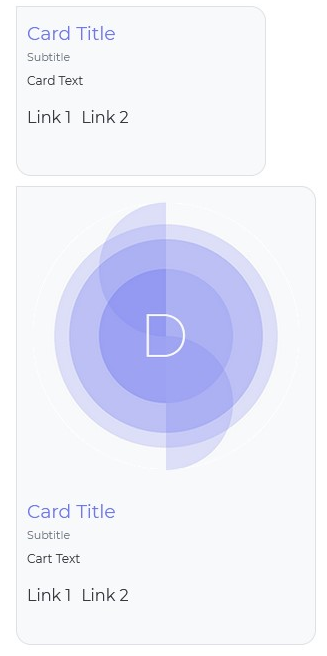

# Diyalog Yanıtları

DialogEngine'nin hali hazırda bulunan cevap seçenekleri 

## Destekleyen

|          Servis         |          Destek         |         Versiyon         |
| :---------------------: | :---------------------: | :----------------------: |
| DialogEngine Messenger  | Tam                     | v1                       |
| Facebook Messenger      | Tam                     | Yapımı Devam Ediyor      |
| Discord                 | Öneri Dışında Hepsi*    | Yapımı Devam Ediyor      |
| Skype                   | Tam                     | Yapımı Devam Ediyor      |
| Twitter                 | Sadece normalCevap      | Yapımı Devam Ediyor      |
| Facebook                | Sadece normalCevap      | Yapımı Devam Ediyor      |
| Skype                   | Full                    | Yapımı Devam Ediyor      |
| Telegram                | Full                    | Yapımı Devam Ediyor      |

`*Discord üzerinde öneri reaksiyon olarak kullanılmayı düşünülüyor` 

## JSON

Browserda [DialogEngine Messenger](./dialogEngineMessenger.md) scripti yüklendiği zaman `window.DialogEngine` e ekleyeceğiniz `jsonResponse` fonksiyonu ile kullanıcı mesajında eğer json cevabı varsa veriyi alabilirsiniz

```js
 window.DialogEngine.jsonResponse = (data) => {
     console.log(data)
 }
```

## Kart Grubu

`Kart grubu` resimli ve normal kart içerir. Kartların altında iki tane var link var. Bu linklere url ekleyebilirsiniz



## Mesaj Balonu Grubu

`Mesaj Balonu Grubu` normal cevap, öneri balonu ve resim balonu olmak üzere 3 tip mesaj cevabı içerir. Öneri balonuna eklediğiniz yazılar kullanıcı tıkladığı zaman mesaj olarak asistana iletilir. 


# Gecikme

Bu cevap tipi ile mesajlarınızın arasına gecikme ekleyebilirsiniz, bu şekilde daha normal bir sohbet sergileyebilirsiniz. Gecikme bitene kadar kullanıcı cevap veremez. Maksimum 5 saniye minimum 700ms saniye gecikme eklenebilir.  