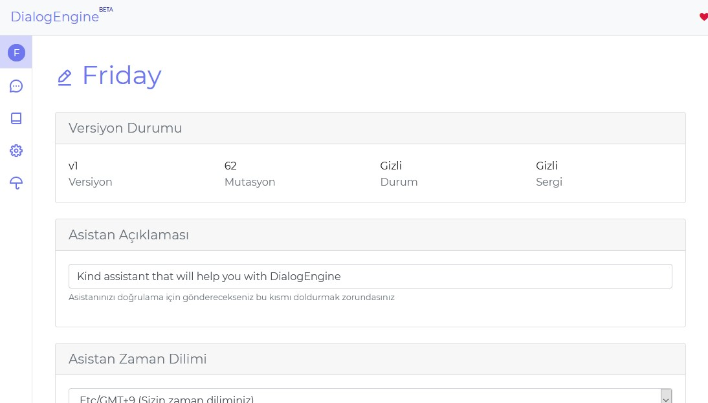
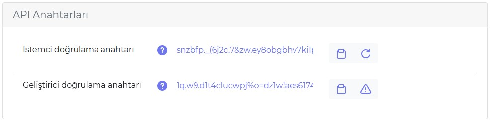

# Asistan Sayfası

* `Asistan Açıklamasını` doldurarak `Dialogengine` sayfansında asistanınızı sergileyebilirsiniz.

* `Asistan Zaman Dilimi` zaman tabanlı diyaloglarda ve `cümle analizinde` kullanılır.

## İstemci doğrulama anahtarı

SDKların ihtiyaç duyduğu asistanınızla iletişime geçmeyi sağlayan anahtar. Ele geçirilme drumunda yenilenebilir

## Geliştirici doğrulama anahtarı

Workerın ihtiyaç duyduğu diyaloglarınızı manipüle edebilme yetkisine sahip anahtar. Paylaştığınız yerlere dikkat edin ele geçirilme durumunda diyalogları veya zihin verinizi düzenleyebilir. Bu durumunda anahtarın sağında yer alan uyarı butonundan asistanınızı kapatabilir `info@behemehal.net` mail adresine bir mail atarak geliştirici doğrulama anahtarınızı yeniliyebilirsiniz. 