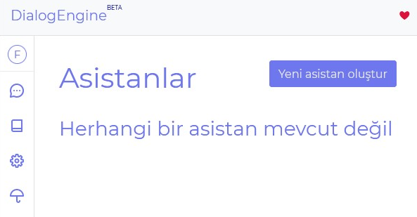

# Asistan Oluşturma

Arayüzün sol tarafındaki menüde bulunan `Asistanlar` sekmesine girin

Ardından çıkan sayfada `Yeni Asistan Oluştur` butonuna basın

`Asistan ismi`'ni ve `Asistan Zaman Dilimi` bölümünü doldurun, `Asistan Zaman Dilimi` zaman tabanlı diyaloglarda ve `cümle analizinde` kullanılır. Asistan Dilini de tercihinize göre kullanın ardından `Yeni asistan oluştur` butonuna tıklayın

Bir sonraki adım [Diyalog Oluşturma](./creatingDialogs.md)