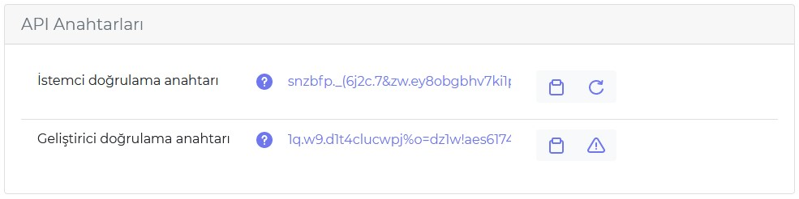

# DialogEngine Messenger
Asistanınızı sitenize entegre edin. Kullanıcılar asistanınız ile sohbet balonu ile sohbet edebilirler

## Başlarken
Panelin sol tarafında yer alan [Asistan](./assistant) sayfasına girin. Asistanınızın isminin baş harfinin olduğu bir ikon ve ismi bulunur.


Ardından [İstemci Doğrulama Anahtarını](./assistant#İstemci-doğrulama-Anahtarı) kopyalayın



```html
  <dialogEngineMessenger messageTitle="FridayAI" assistantClientKey=""></dialogEngineMessenger>
  <script src="https://dialogengine.behemehal.net/dialogEngineMessenger/dialogEngineMessenger.js"></script>
```


## DialogEngineMessenger Ayarları

```js
    messageTitle="string" //Pencere başlığı
    assistantClientKey="string" //İstemci Anahtarı
    popOnFunction="boolean" //İkon sadece fonksiyon çağırıldığında gelir*
  ```

  `*window.DialogEngine.pop()`