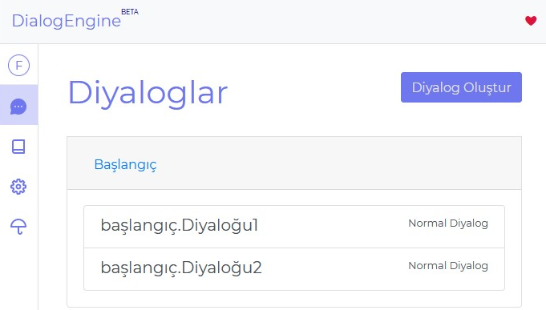

# Diyaloglar

Diyaloglar sayfasında diyalogların üstüne tıklayıp onları güncelleyebilir veya silebilirsiniz

## Önyanıtlar

Cümle analizi yapmadan direk yanıt alabileceğiniz diyaloglara `önyanıt` denir. Sistemin tanıdığı `welcome.Fallback`, `unknown.Fallback` ve `maintenance.Fallback` olmak üzere üç tane `önyanıt` vardır. Kendi amacınız için kullanabileceğiniz `önyanıtları` `{önyanıtismi.Fallback}` şeklinde kaydedebilirsiniz.

---

## `welcome.Fallback`

Servisler tarafından kullanılır. Her servis bu yanıtı farklı şekilde kullanabilir. Örneğin DialogEngine Messenger kullanıcı sayfayı veya pencereyi açtığında gözükmek üzere bu yanıtı kullanır

## `unknown.Fallback`

Eşleşmeyen diyaloglarda `unknown_dialog` yerine kullanılıcak yanıtdır

## `maintenance.Fallback`

Bakım modunda kullanıcıya gönderilecek yanıttır