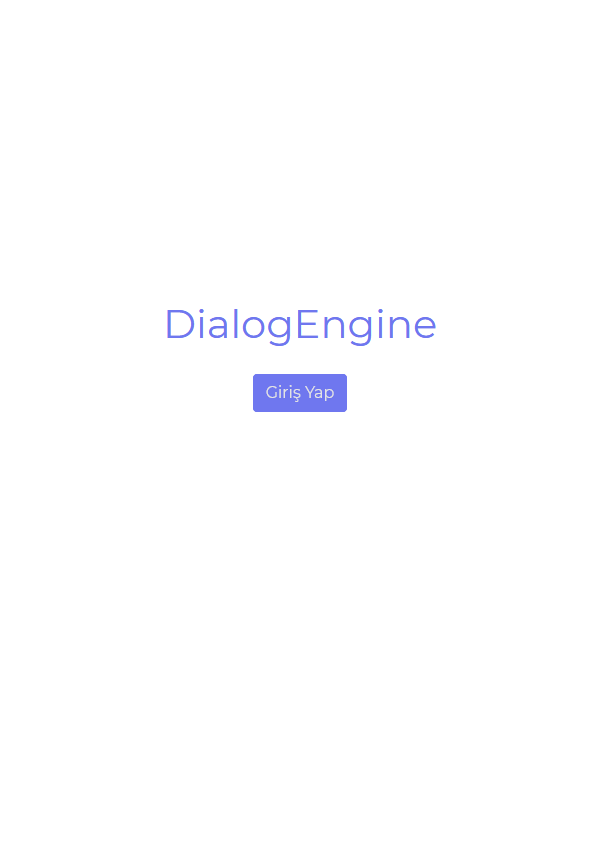

# DialogEngine Dokümanlarına Hoşgeldiniz

### İçindekiler
- [Başlarken](#başlarken)
  - [Asistan Oluşturma](./creatingAssistant)   
  - [Diyalog Oluşturma](./creatingDialogs)
  - [DialogEngine SDK'ları](./sdk)
  - [DialogEngine Worker](./worker)
- [Asistan Sekmesi](./assistant)
- [Diyaloglar Sekmesi](./dialogs)
- Örnekler **Tamamlanmadı**
- [Katkı](#katkı)
- [Versiyonlama](#versiyonlama)
- [Lisans](#lisans)

# Başlarken
Behemehal servsilerine hoşgeldiniz! Başlamadan önce bir [behemehal hesabı](https://behemehal.net/login) oluşturmanız gerekmekte. Hesabınızı oluşturdukdan sonra [DialogEngine Paneline](https://dialogengine.behemehal.net/panel.html) gidebilirsiniz.




Bir sonraki adım [Asistan Oluşturma](./creatingAssistant)


# Katkı
Görüşlerinizi fikirlerinizi önemsiyoruz, eğer katkıda bulunmak istediğiniz kütüphanede katkı kuralları mevcutsa bu kurallara uyarak bizlere yardımcı olabilirsiniz, DialogEngine Dokümanları ve örnekleri katkınızı bekliyor. 


# Versiyonlama
Bu proje [Semantic Versiyonlama](https://semver.org/) kullanıyor. Gelen özellik ve güvenlik güncellemeleri aynı jenerasyon ile geriye dönük uyumluluk sağlar

# [Lisans](../LICENSE)

```
MIT License

Copyright (c) 2020 Behemehal

Permission is hereby granted, free of charge, to any person obtaining a copy
of this software and associated documentation files (the "Software"), to deal
in the Software without restriction, including without limitation the rights
to use, copy, modify, merge, publish, distribute, sublicense, and/or sell
copies of the Software, and to permit persons to whom the Software is
furnished to do so, subject to the following conditions:

The above copyright notice and this permission notice shall be included in all
copies or substantial portions of the Software.

THE SOFTWARE IS PROVIDED "AS IS", WITHOUT WARRANTY OF ANY KIND, EXPRESS OR
IMPLIED, INCLUDING BUT NOT LIMITED TO THE WARRANTIES OF MERCHANTABILITY,
FITNESS FOR A PARTICULAR PURPOSE AND NONINFRINGEMENT. IN NO EVENT SHALL THE
AUTHORS OR COPYRIGHT HOLDERS BE LIABLE FOR ANY CLAIM, DAMAGES OR OTHER
LIABILITY, WHETHER IN AN ACTION OF CONTRACT, TORT OR OTHERWISE, ARISING FROM,
OUT OF OR IN CONNECTION WITH THE SOFTWARE OR THE USE OR OTHER DEALINGS IN THE
SOFTWARE.
```